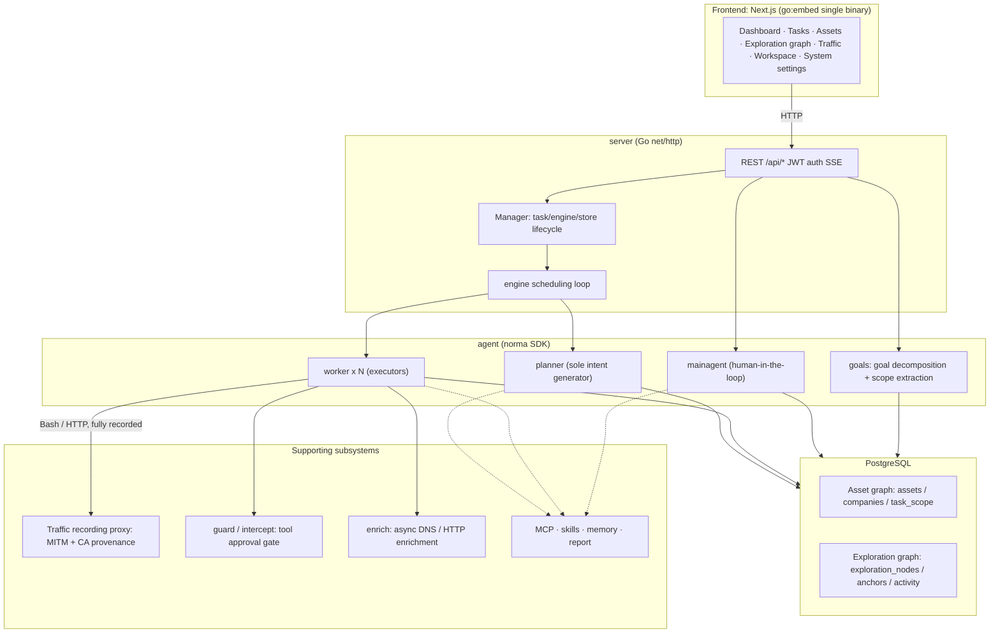
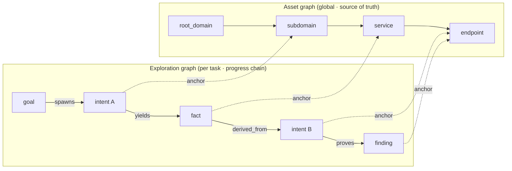
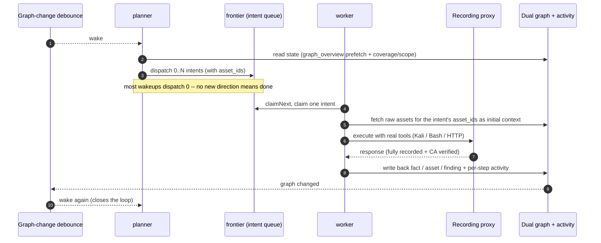
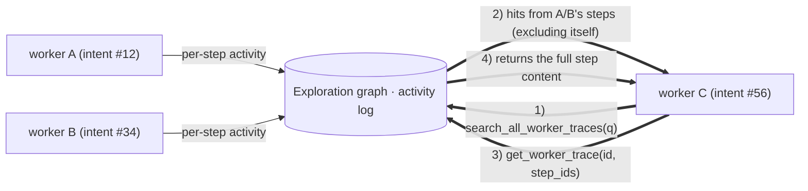
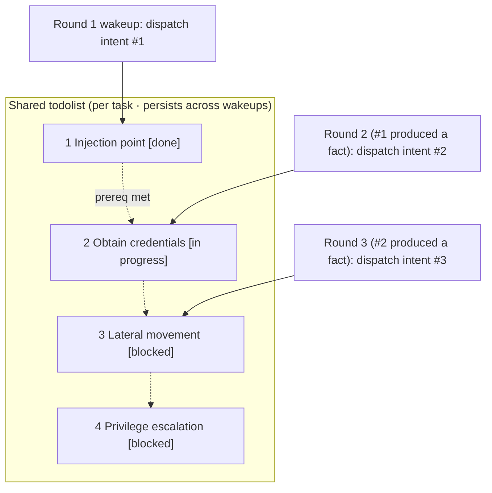

<div align="center">

# ARTEX

[한국어 안내](README.md) · [보안 점검 결과](docs/security-review-2026-10-02.md)

An AI autonomous penetration testing system (Go backend + Next.js frontend)


🌐 **Live demo**: [https://artex-demo.vercel.app/](https://artex-demo.vercel.app/)

</div>

---

## Screenshots

> See the [live demo](https://artex-demo.vercel.app/) for the full interactive experience.

| Dashboard (overview / token usage / activity feed) | Task list |
| :---: | :---: |
|  |  |

| Task · execution trace (sessions / tool calls) | Exploration graph |
| :---: | :---: |
|  |  |

| Findings | Assets |
| :---: | :---: |
|  |  |

| Asset coverage graph (force-directed layout · tested highlighting · node collapse/expand) |
| :---: |
|  |

| Traffic recording | Human-in-the-loop chat |
| :---: | :---: |
|  |  |

| Agent management | LLM config |
| :---: | :---: |
|  |  |

| Intercept approvals | Backend logs |
| :---: | :---: |
|  |  |


---

## Approval record details

The global "Approval Records" page, in-task "Intercept Approvals", and approval cards in chat all support expanding to view details. The display structure is based on
[AegisHook's approval detail component](https://github.com/RuoJi6/AegisHook/blob/main/web/src/components/CallDetail.vue), reusing ARTEX's own components and theme:


## Asset sync (ScopeSentry)

Supports syncing asset data directly from [ScopeSentry](https://github.com/Autumn-27/ScopeSentry), avoiding duplicate collection:

- On the **Asset Sync** page, fill in the ScopeSentry address and API key to connect the data source;
- Choose which targets and asset types to sync by **project** or by **task** (domains / subdomains / IPs / ports / sites / endpoints...);
- Import with one click and merge by company asset scope, feeding directly into ARTEX's asset graph for agents to explore.

---

## Installation

> Requires a **PostgreSQL** database; exploration requires an **LLM** (`ANTHROPIC_API_KEY` or `OPENAI_API_KEY`, configurable in the UI too).

### Method 1: One-click install script (recommended)

```bash
git clone https://github.com/Autumn-27/ARTEX.git
cd ARTEX
./install.sh
```

The script will: detect / auto-install Docker -> let you choose **1) all-Docker** or **2) build and run locally**:

- **1) All-Docker**: enter a Postgres password (press Enter for a random one) -> auto-writes `.env` -> `docker compose up -d`.
- **2) Run locally**: choose a database (connect to an existing one / spin one up with Docker) -> generate `config.json` -> `go` build with the embedded single binary -> start.

Once installed, open **http://localhost:8787** (first visit goes to `/setup` to set the admin password).

### Method 2: Docker Compose (manual)

```bash
git clone https://github.com/Autumn-27/ARTEX.git
cd ARTEX
cp .env.example .env          # fill in POSTGRES_PASSWORD, optionally ANTHROPIC_API_KEY
docker compose up -d          # pulls the autumn27/artex image + postgres
# -> http://localhost:8787
```

The image already includes common tools (ripgrep/curl/vim/npm/nmap...); `./skills` and `./data` are persisted via bind mounts.

Remote MCP can be set to `http` (Streamable HTTP) or `sse` (legacy SSE) in System Settings.
Legacy SSE services typically open an event stream via `GET /sse`, then receive JSON-RPC requests via the
`/message?sessionId=...` URL returned by the service; when configuring, set the URL to `/sse` and the request header to
`Authorization=Bearer <token>`.

### Method 3: Download a precompiled binary (Releases)

Download the zip for your platform from [Releases](https://github.com/Autumn-27/ARTEX/releases); after extracting you get `artex` + `start.sh` (`start.bat` on Windows) + `skills/` + `config.example.json`:

```bash
cp config.example.json config.json   # fill in the database connection
./start.sh                           # -> http://localhost:8787
```

> Please start with `start.sh` / `start.bat` rather than running `./artex` directly. It's a supervisor script: after the process exits, it decides whether to relaunch based on the exit code, and **the in-app [one-click update](#method-1-one-click-in-app-update-recommended) relies on it to swap the binary**. Running `./artex` directly means it won't be relaunched after an update.
> To keep it running in the background: `nohup ./start.sh >artex.log 2>&1 &`.

### Method 4: Build the single binary from source

```bash
# 1) Static frontend export
cd web && npm ci && npm run build:static && cd ..
# 2) Copy into the embed directory
cp -r web/out server/webui/dist
# 3) Build (-tags embedui is required to embed the frontend)
CGO_ENABLED=0 go build -tags embedui -o artex ./cmd/artex
./start.sh
```

### Method 5: Build cross-platform release archives

`build.sh` first builds and embeds the frontend, then strips debug info with the Go linker and packages the release files as zip archives. Release mode by default produces zips for Linux amd64/arm64, macOS amd64/arm64, and Windows amd64:

```bash
./build.sh --release
# Output: dist/artex-0.3.3-*.zip
```

UPX self-extracting binaries can be incompatible with some Linux kernels, virtualization environments, or security policies, so they're disabled by default. Customize targets with `ARTEX_TARGETS`; once you've confirmed compatibility with your target environment, pass `--upx` explicitly to further shrink the binary:

```bash
ARTEX_TARGETS=linux/amd64,windows/amd64 ./build.sh --release
./build.sh --target linux/amd64 --upx
```

---

## Updating

> Upgrading only swaps the program, never touches data: the Postgres volume `pgdata`, `./data` (jwt.key / SQLite etc.), and `./skills` are all preserved. **No manual database migration needed** -- on every startup, `artex` idempotently re-runs `schema.sql` (including `ADD COLUMN` / `CREATE INDEX IF NOT EXISTS`), so "restart == migrate". Still, back up `./data` and the database before upgrading.

### Method 1: One-click in-app update (recommended)

On the **System Settings** page (sidebar "System Settings" -> `/system/settings`), the **Version & Updates** card lets you check for and install new versions directly, with no need to log into the server.

Clicking "Update": downloads the release package for the current platform -> verifies against the Release's `SHA256SUMS` -> smoke-tests the new binary with `-h` -> stages it as `artex.new` -> the process exits, and `start.sh` / `start.bat` relaunches it to complete the swap. The page automatically waits and refreshes once the new version is up.

- **A failure never leaves a broken install**: if verification or the smoke test fails, the staged file is discarded and the current version keeps running; if the newly swapped-in version fails to start 3 times in a row, it automatically rolls back to `artex.old` (the failed one is kept as `artex.failed` for troubleshooting).
- **Always revertible**: the previous version is kept as `artex.old`, and the card has a "Roll back to previous version" option. Note that database schema changes are not rolled back.
- **An update interrupts running tasks** -- updating means restarting, so do it when idle.
- **No updates for dev builds**: disabled when the version string is `dev` or a `git describe` build with a suffix, to avoid an official release overwriting a locally debugged binary.
- **Under Docker, only the program is swapped, not the image**: tool chains baked into the image (playwright, nmap, etc.) won't be upgraded, and rebuilding the container via `docker compose up -d` reverts to the version bundled in the image. To upgrade the image too, use `docker compose pull artex && docker compose up -d artex`.
- If reaching GitHub requires a proxy, configure a **global proxy** on the same page and the update path will use it. Updates only download from GitHub domains and always use HTTPS.

### Method 2: One-click update script

```bash
cd ARTEX
./update.sh
```

The script first optionally runs `git pull` to fetch the latest code, then lets you choose **1) Docker update** or **2) local build update** (matching `install.sh`):

- **1) Docker**: optionally specify a target image tag (press Enter to reuse `.env`'s `ARTEX_TAG`, defaulting to `latest`) -> `docker compose pull` -> `docker compose up -d` (restarting with the new image auto-migrates).
- **2) Local**: rebuilds the static frontend bundle -> recompiles `./artex` (restart the process afterward to take effect).

### Method 3: Docker Compose (manual)

```bash
cd ARTEX
git pull                       # update compose files / scripts (optional)
# pin a version: set ARTEX_TAG=v0.2.0 in .env; defaults to latest otherwise
docker compose pull artex
docker compose up -d artex     # restart with the new image -> auto-migrates the schema
docker image prune -f          # clean up old images (optional)
```

### Method 4: Precompiled binary (Releases)

Download the new version's zip from [Releases](https://github.com/Autumn-27/ARTEX/releases), stop the old process, overwrite `artex` and `skills/` (keeping your `config.json` and `data/`), then restart:

```bash
cp -r <extracted-dir>/skills ./ && cp <extracted-dir>/artex ./
./start.sh
```

### Method 5: Build from source

```bash
git pull
cd web && npm ci && npm run build:static && cd ..
cp -r web/out server/webui/dist
CGO_ENABLED=0 go build -tags embedui -o artex ./cmd/artex
# restart ./start.sh
```

---

## Configuration

**Database** (`config.json`, or override with the `ARTEX_PG_DSN` environment variable):

```json
{
  "database": {
    "host": "127.0.0.1", "port": 5432,
    "user": "artex", "password": "yourpass",
    "dbname": "artex", "sslmode": "disable"
  }
}
```

**LLM**: `export ANTHROPIC_API_KEY=sk-...` (or `OPENAI_API_KEY`), or fill it in on the UI's "LLM Config" page.
Optional: `ARTEX_LLM_PROVIDER` / `ARTEX_LLM_MODEL` / `ARTEX_LLM_BASE_URL` / `ARTEX_LLM_PROXY`.

**Concurrency**: the number of work agents per task is configured under "System Settings" (default 3).

**Common flags**: `./start.sh -addr :8787 -proxy :8788` (`-addr` is frontend+API, `-proxy` is the traffic recording proxy). The start script passes flags through to `artex` unchanged.

---


## Development

### Manual vulnerability retesting

The task detail page's "Retest" tab lets you page through this task's vulnerabilities, view past conclusions and evidence, and manually kick off a retest. Once started, the tab stays current and shows a spinner with "Retesting"; once a fix is confirmed, the vulnerability status is updated accordingly.

Click "Retest" in a finding row's action area, or click "Start retest" in the "Vulnerability Retest" section of a finding's detail view, optionally filling in a fix version, test conditions, or constraints; the system creates an independent retest agent session and keeps the current page once started. This entry point is available from the flat list, grouped-by-task view, and asset view alike; while a retest is running it shows a spinner with "Retesting", and clicking it opens the corresponding session, reverting to "Retest" once done. A retest doesn't require restarting the original scan task; conclusions fall into "Still reproducible", "Fixed", or "Could not confirm", and each run's conclusion, evidence, and session link are saved in the finding's detail view.

A new backend install provisions an editable "Vulnerability Retest" (`retester`) agent on first start, configurable in Agent Management for prompt, LLM, run budget, and tools. It uses its bound LLM by default, falling back to the globally active config if unbound. When a retest session completes successfully with a "Fixed" conclusion, the system automatically updates the finding's disposition status to "Fixed"; in-progress, failed, stopped, or other conclusions leave the status unchanged. Original evidence and reports are always kept. You can also manually select "Fixed" from the status dropdown. While a given vulnerability is being retested, a new request reuses the existing session; a new one can be started after it stops, fails, or the service restarts.

This version's history is viewed via the finding's detail view and sessions, and isn't yet included in vulnerability report exports or task archive bundles, nor is it auto-linked to traffic captures. Demo mode only generates clearly labeled simulated records and never contacts real targets.

### Running and testing locally

```bash
./dev.sh    # backend(:8787) + traffic proxy(:8788) + frontend next dev(:5173) -> http://localhost:5173
```

- Backend: `go run ./cmd/artex` (without `-tags embedui` the frontend isn't embedded)
- Frontend: `cd web && npm run dev` (`/api` proxied to the backend, with hot reload)
- Tests: `go test ./...`
- Mock preview (no backend): `cd web && NEXT_PUBLIC_MOCK=1 npm run dev`

---

## System architecture

ARTEX is an **LLM multi-agent driven autonomous penetration testing system**: a Go monolith backend (embedding the Next.js frontend) + PostgreSQL, with agent capabilities provided by the [`norma`](https://github.com/Autumn-27/norma) SDK (`agentcore` / `tool` / `permission` / `harness` / `memory` / `transcript`). At its core is a **dual-graph architecture**, with two autonomy mechanisms built around it: **process-level information exchange between workers**, and **a planner-held, multi-round shared todolist that keeps attack chains stable**.

### Overall layering



| Layer | Responsibility |
| --- | --- |
| **Frontend** | Next.js static export, embedded into the single binary via `go:embed`; visualizes tasks/assets/exploration chains/coverage graphs, human-in-the-loop chat |
| **server** | `net/http` routing + JWT auth + SSE; `Manager` owns the lifecycle of tasks, engines, and the DB store |
| **engine** | One `plannerLoop` per task + N worker goroutines; intent claiming, timeout/pause/drain |
| **agent** | goals / planner / worker / mainagent; `ToolSet` exposes the dual graph as LLM tools |
| **db** | Postgres persistence for the dual graph (pgx); the schema is idempotently applied on every startup via `go:embed` |
| **Supporting** | Recording MITM proxy, approval gate, async enrichment, MCP/skills/memory/report |

### Dual-graph architecture: exploration graph + asset graph

The system splits "**what is the goal**" and "**how far has testing gone**" into two independent graphs, connected only through anchors:

- **Asset Graph (global, shared)**: a single source of truth for assets shared across tasks. Nodes are `root_domain / subdomain / ip / service / app / endpoint`, scoped to a company; the parent-child relationships (domain -> subdomain -> service -> endpoint) and dedup keys are all computed by the program -- agents only submit raw information.
- **Exploration Graph (per task)**: the "thinking and progress" of a single task. Nodes are `goal / intent / fact / finding / hint`, linked by edges such as `spawns / derived_from / yields / proves` into a **lineage chain** that answers "which direction was derived from which facts, and produced what".
- **The two graphs are connected via anchors**: `exploration_anchors(node_id, asset_id)` pins intents/facts/findings to specific assets -- so you can see which assets a given exploration direction targets, and conversely, look up which intents tested a given asset in this task and what facts they produced. This also powers **asset test coverage** and the **asset coverage graph** (in-scope assets + tested highlighting).



> Division of labor: the **planner** reads the exploration graph's state, judges the goal, and only dispatches **intents** into the frontier when there's an uncovered new direction; a **worker** claims **one intent**, executes it with real tools, writes new assets/facts/findings back to both graphs, then stops. The asset graph is shared fact; the exploration graph is each task's own progress chain.

### Engine and intent lifecycle (one exploration loop)

The engine is an **event-driven** closed loop: any graph change wakes the planner, the planner dispatches intents, a worker claims and executes an intent and writes back, and that write-back triggers the next round -- until the goal is proven (`prove_goal`).



### Process-level information exchange between workers

In a deep exploration, many valuable observations (an error message, a response body, a hidden parameter) surface during a worker's **execution process**, without necessarily being written up as a formal fact. To avoid duplicated effort and let workers down the chain build on each other's work, a worker can **search across other workers' execution traces**:

- `search_all_worker_traces(q)`: keyword-search across **other workers' execution traces in the same task** (automatically excluding its own intent's steps); hits include the `intent_id`;
- `list_worker_traces` / `get_worker_trace(intent_id, step_ids=[...])`: first see which workers have run, then fetch the full content of specific steps from one for detailed exchange.

This way, even without a corresponding fact yet in the exploration graph, later workers can reuse others' observations -- **information flows between workers at the granularity of "execution process"**, while the boundary stays intact (each worker still only works its own claimed intent).



### Planner's multi-round shared todolist -> stable attack chains

A real attack chain is often a **multi-step sequence with dependencies** (e.g.: find an injection point -> obtain credentials -> move laterally -> escalate privileges); dispatching all of it in parallel at once would just create chaos. The planner therefore holds a **per-task, cross-wakeup shared planning todolist**:

- The planner is event-driven -- woken up on every graph change, but **each wakeup is a brand-new session**; the shared todolist lets it **record a serial exploitation chain once**, then **dispatch intents step by step according to dependencies** across subsequent rounds, rather than unrolling the whole chain up front in a single round;
- Each round only dispatches an intent for the next step whose prerequisites are complete and whose dependent facts already exist, updating the list as progress is made (marking steps satisfied by facts as done).



This keeps the attack chain **progressing steadily, without repetition or reordering**, even in an "event-driven, stateless session" environment -- this is key to ARTEX being able to autonomously work through multi-step exploitation chains.

---

## Community

Scan the QR code to follow the WeChat official account **SecSentry**, then message it to join the discussion group.

<div align="center">


</div>

---
## Reference

https://github.com/oritera/Cairn


## License and disclaimer

### Open-source license

This project is licensed under the **GNU Affero General Public License v3.0 (AGPL-3.0)**; see the [LICENSE](LICENSE) file in the repository root for the full terms.

This means anyone may freely use, modify, and distribute this project, but **derivative works must also be open-sourced under AGPL-3.0**; in particular, **if you modify this project and make it available to users over a network (e.g. deployed as an online service), you must also make the corresponding complete source code available to those users.**

> ⚠️ **Important**: the open-source license itself does not restrict the purposes for which the software may be used. The "Permitted use" and "Disclaimer" sections below are the author's additional terms and formal notice to users, and must be followed.

**ARTEX is intended only for personal learning, code research, and local technical verification. It must not be used to run actual tests against any live system or website.**

### Permitted use

- Only for **reading, learning from, and researching this project's source code**, and for verifying technical principles in a **local, isolated environment**;
- Suitable for personal learning, academic research, code review, and other non-offensive purposes.

### Prohibited uses

- **Strictly forbidden: using this tool to scan, probe, exploit, or attack any website, online service, or networked system** (regardless of whether authorization was obtained or whether the asset is your own);
- Strictly forbidden to use this tool for any actual penetration test, red/blue team engagement, or against a production environment;
- Strictly forbidden to use this tool for illegal intrusion, data theft, extortion, denial of service, or any other destructive or criminal activity;
- Strictly forbidden to use this tool in any way that violates the laws and regulations of your country or region.

### Compliance responsibility

Users must comply with all applicable laws and regulations in their country/region regarding cybersecurity, data protection, and computer crime (in mainland China, including but not limited to the Cybersecurity Law, the Data Security Law, the Personal Information Protection Law, and related judicial interpretations). **Any and all legal liability and consequences arising from use of this tool are the sole responsibility of the user.**

### Disclaimer

This project is provided "AS IS", without warranty of any kind, express or implied. The author and contributors are not liable for any direct or indirect loss, data loss, system damage, or legal dispute arising from use of this tool (regardless of whether it was used properly). **By downloading, installing, or using this project, you confirm that you have read, understood, and agreed to all of the terms above.**
