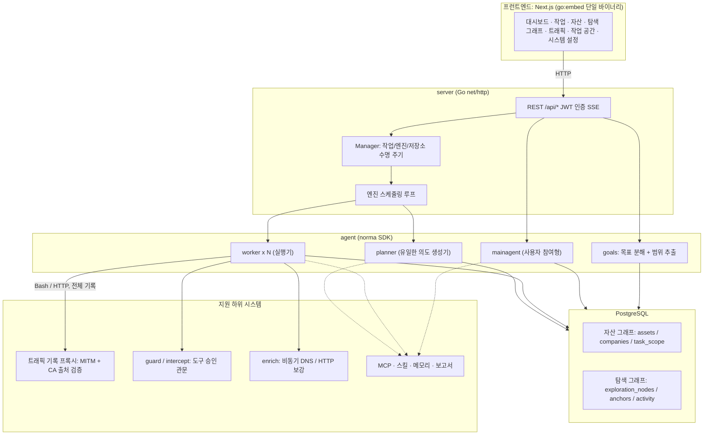
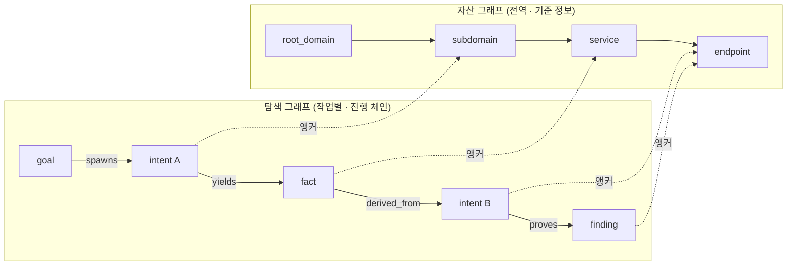
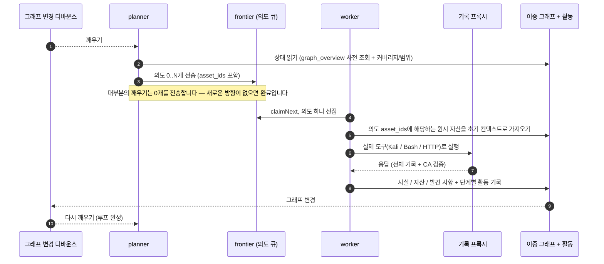
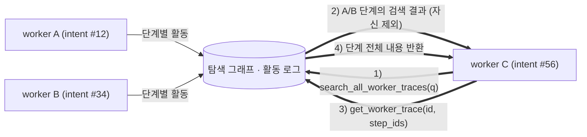
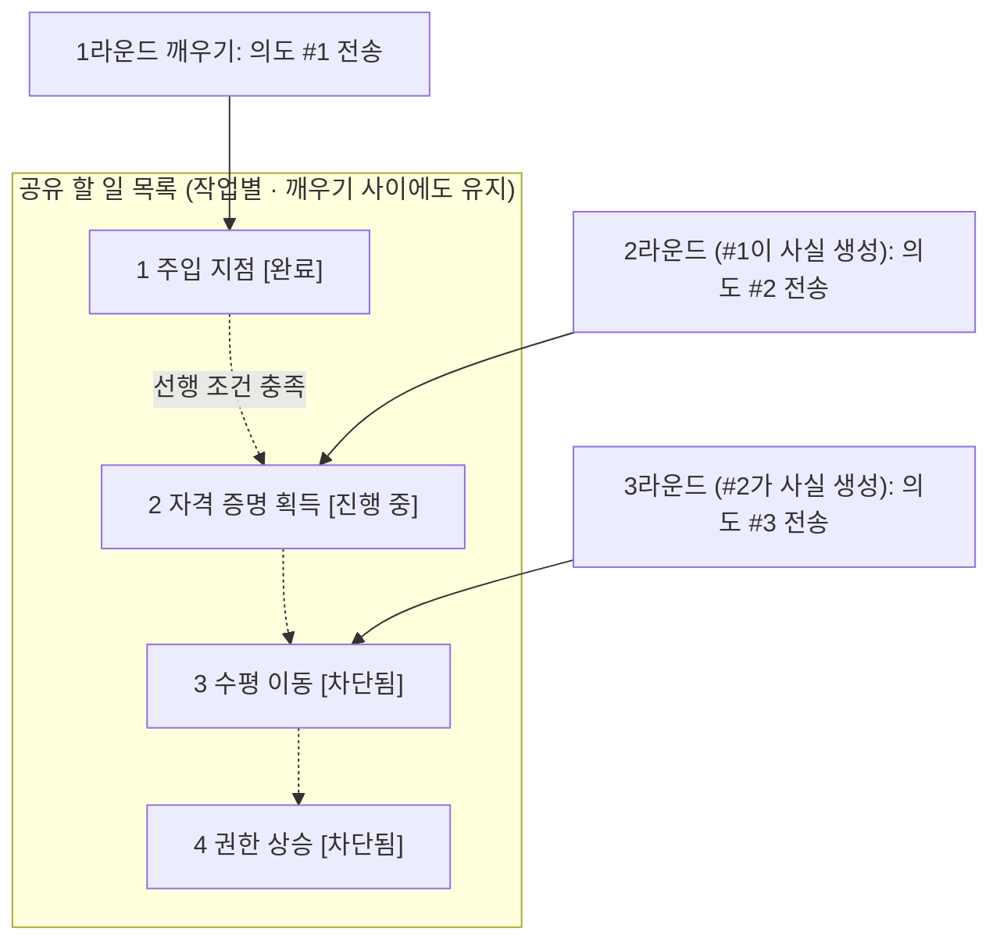

<div align="center">

# ARTEX

[English](README.en.md) · [보안 점검 결과](docs/security-review-2026-10-02.md)

AI 자율 침투 테스트 시스템 (Go 백엔드 + Next.js 프런트엔드)


🌐 **라이브 데모**: [https://artex-demo.vercel.app/](https://artex-demo.vercel.app/)

</div>

---

## 한국어판 안내

이 저장소는 [Autumn-27/ARTEX](https://github.com/Autumn-27/ARTEX)의 한국어 UI 번역판입니다. 메뉴, 작업·취약점·트래픽·설정 화면, 서버 오류 안내 및 업데이트 메시지를 한국어로 제공합니다. 이전 중국어 채팅 참조 기록도 계속 읽을 수 있습니다.

위 라이브 데모와 아래 스크린샷은 원본 프로젝트의 화면입니다. 원본 Docker 이미지와 원본 Releases 바이너리에는 이 한국어 변경이 포함되지 않습니다. **한국어판은 이 저장소의 소스로 빌드하세요.**

```bash
git clone https://github.com/seongilp/ARTEX.git
cd ARTEX
# config.example.json을 config.json으로 복사하고 PostgreSQL 연결 정보를 설정
cp config.example.json config.json
cd web && npm ci && npm run build:static && cd ..
mkdir -p server/webui/dist
cp -R web/out/. server/webui/dist/
CGO_ENABLED=0 go build -tags embedui -o artex ./cmd/artex
./start.sh -addr 127.0.0.1:8787
```

브라우저에서 `http://127.0.0.1:8787`에 접속하여 초기 비밀번호를 설정합니다. 실제 에이전트 실행에는 LLM 설정이 필요합니다. 아래 원본 설치·업데이트 방식은 참고용이며, 원본 배포본으로 업데이트하면 한국어 변경이 덮어써질 수 있습니다.

[보안 점검 보고서](docs/security-review-2026-10-02.md)에는 발견된 위험과 검증 범위를 기록했습니다. 코드 주석·개발 로그·기존 데이터·사용자가 편집한 프롬프트 및 외부 LLM의 응답은 자동 번역하지 않습니다.

---

## 스크린샷

> 전체 대화형 환경은 [라이브 데모](https://artex-demo.vercel.app/)에서 확인하세요.

| 대시보드 (개요 / 토큰 사용량 / 활동 피드) | 작업 목록 |
| :---: | :---: |
|  |  |

| 작업 · 실행 추적 (세션 / 도구 호출) | 탐색 그래프 |
| :---: | :---: |
|  |  |

| 발견 사항 | 자산 |
| :---: | :---: |
|  |  |

| 자산 커버리지 그래프 (힘 기반 배치 · 테스트 항목 강조 · 노드 접기/펼치기) |
| :---: |
|  |

| 트래픽 기록 | 사용자 참여형 채팅 |
| :---: | :---: |
|  |  |

| 에이전트 관리 | LLM 설정 |
| :---: | :---: |
|  |  |

| 인터셉트 승인 | 백엔드 로그 |
| :---: | :---: |
|  |  |


---

## 승인 기록 상세 정보

전역 **승인 기록** 페이지, 작업 내 **인터셉트 승인**, 채팅의 승인 카드에서는 모두 항목을 펼쳐 세부 정보를 볼 수 있습니다. 표시 구조는
[AegisHook의 승인 상세 컴포넌트](https://github.com/RuoJi6/AegisHook/blob/main/web/src/components/CallDetail.vue)를 참고하되 ARTEX 자체 컴포넌트와 테마를 사용합니다:


## 자산 동기화 (ScopeSentry)

[ScopeSentry](https://github.com/Autumn-27/ScopeSentry)에서 자산 데이터를 바로 동기화해 중복 수집을 피할 수 있습니다.

- **자산 동기화** 페이지에서 ScopeSentry 주소와 API 키를 입력해 데이터 소스를 연결합니다.
- **프로젝트** 또는 **작업** 기준으로 동기화할 대상과 자산 유형(도메인 / 하위 도메인 / IP / 포트 / 사이트 / 엔드포인트 등)을 선택합니다.
- 한 번의 클릭으로 가져와 회사 자산 범위에 맞게 병합하고, 에이전트가 탐색하는 ARTEX 자산 그래프에 반영합니다.

---

## 설치

> **PostgreSQL** 데이터베이스가 필요합니다. 탐색 기능에는 **LLM**이 필요하며 (`ANTHROPIC_API_KEY` 또는 `OPENAI_API_KEY`), UI에서도 설정할 수 있습니다.

### 방법 1: 원클릭 설치 스크립트 (권장)

```bash
git clone https://github.com/Autumn-27/ARTEX.git
cd ARTEX
./install.sh
```

스크립트가 Docker를 확인하고 없으면 자동 설치한 뒤, **1) 전체 Docker 실행** 또는 **2) 로컬 빌드 및 실행**을 선택하게 합니다.

- **1) 전체 Docker**: PostgreSQL 비밀번호를 입력합니다(Enter를 누르면 임의 비밀번호 생성). `.env`를 자동으로 작성하고 `docker compose up -d`를 실행합니다.
- **2) 로컬 실행**: 데이터베이스를 선택합니다(기존 데이터베이스에 연결하거나 Docker로 실행). `config.json`을 만들고, 프런트엔드가 포함된 단일 바이너리를 Go로 빌드한 뒤 실행합니다.

설치가 끝나면 **http://localhost:8787**을 여세요. 처음 접속하면 `/setup`으로 이동해 관리자 비밀번호를 설정합니다.

### 방법 2: Docker Compose (수동)

```bash
git clone https://github.com/Autumn-27/ARTEX.git
cd ARTEX
cp .env.example .env          # POSTGRES_PASSWORD 및 필요하면 ANTHROPIC_API_KEY 입력
docker compose up -d          # autumn27/artex 이미지와 postgres를 가져와 실행
# -> http://localhost:8787
```

이미지에는 ripgrep/curl/vim/npm/nmap 등 자주 쓰는 도구가 포함되어 있습니다. `./skills`와 `./data`는 바인드 마운트로 보존됩니다.

시스템 설정에서 원격 MCP 전송 방식을 `http`(Streamable HTTP) 또는 `sse`(기존 SSE)로 지정할 수 있습니다.
기존 SSE 서비스는 보통 `GET /sse`로 이벤트 스트림을 연 다음 서비스가 반환한 `/message?sessionId=...` 주소로 JSON-RPC 요청을 받습니다. 설정할 때 URL은 `/sse`로 지정하고 요청 헤더에
`Authorization=Bearer <token>`을 입력하세요.

### 방법 3: 사전 빌드 바이너리 다운로드 (릴리스)

[릴리스](https://github.com/Autumn-27/ARTEX/releases)에서 사용 중인 플랫폼의 zip 파일을 내려받으세요. 압축을 풀면 `artex`, `start.sh`(Windows는 `start.bat`), `skills/`, `config.example.json`이 들어 있습니다.

```bash
cp config.example.json config.json   # 데이터베이스 연결 정보 입력
./start.sh                           # -> http://localhost:8787
```

> `./artex`를 직접 실행하지 말고 `start.sh` / `start.bat`으로 시작하세요. 이 감독 스크립트는 프로세스가 끝나면 종료 코드에 따라 다시 실행할지 결정합니다. **앱 내 [원클릭 업데이트](#방법-1-앱-내-원클릭-업데이트-권장)는 이 스크립트를 통해 바이너리를 교체합니다.** `./artex`를 직접 실행하면 업데이트 후 자동으로 다시 시작되지 않습니다.
> 백그라운드에서 실행하려면 `nohup ./start.sh >artex.log 2>&1 &`를 사용하세요.

### 방법 4: 소스에서 단일 바이너리 빌드

```bash
# 1) 프런트엔드 정적 내보내기
cd web && npm ci && npm run build:static && cd ..
# 2) 임베드 디렉터리에 복사
cp -r web/out server/webui/dist
# 3) 빌드 (프런트엔드 임베드에 -tags embedui 필요)
CGO_ENABLED=0 go build -tags embedui -o artex ./cmd/artex
./start.sh
```

### 방법 5: 크로스 플랫폼 릴리스 아카이브 빌드

`build.sh`는 먼저 프런트엔드를 빌드해 바이너리에 포함하고, Go 링커로 디버그 정보를 제거한 다음 릴리스 파일을 zip 아카이브로 묶습니다. 기본 릴리스 모드는 Linux amd64/arm64, macOS amd64/arm64, Windows amd64용 zip을 만듭니다.

```bash
./build.sh --release
# 출력: dist/artex-0.3.3-*.zip
```

UPX 자체 추출 바이너리는 일부 Linux 커널, 가상화 환경 또는 보안 정책과 호환되지 않을 수 있어 기본적으로 비활성화되어 있습니다. `ARTEX_TARGETS`로 대상 플랫폼을 지정할 수 있습니다. 대상 환경에서 호환성을 확인한 뒤 `--upx`를 명시하면 바이너리를 더 작게 만들 수 있습니다.

```bash
ARTEX_TARGETS=linux/amd64,windows/amd64 ./build.sh --release
./build.sh --target linux/amd64 --upx
```

---

## 업데이트

> 업그레이드는 프로그램만 교체하며 데이터에는 손대지 않습니다. PostgreSQL 볼륨 `pgdata`, `./data`(jwt.key / SQLite 등), `./skills`는 모두 보존됩니다. **데이터베이스를 수동으로 마이그레이션할 필요가 없습니다.** 시작할 때마다 `artex`가 `schema.sql`을 멱등하게 다시 적용합니다(`ADD COLUMN` / `CREATE INDEX IF NOT EXISTS` 포함). 즉, 재시작하면 마이그레이션됩니다. 그래도 업그레이드 전에 `./data`와 데이터베이스를 백업하세요.

### 방법 1: 앱 내 원클릭 업데이트 (권장)

**시스템 설정** 페이지(사이드바의 **시스템 설정** → `/system/settings`)에 있는 **버전 및 업데이트** 카드에서 서버에 로그인하지 않고 새 버전을 확인하고 설치할 수 있습니다.

**업데이트**를 누르면 현재 플랫폼에 맞는 릴리스 패키지를 내려받고, 릴리스의 `SHA256SUMS`와 대조한 뒤 새 바이너리를 `-h`로 스모크 테스트합니다. 테스트가 통과하면 `artex.new`로 준비하고 현재 프로세스를 종료합니다. `start.sh` / `start.bat`이 다시 실행되어 바이너리 교체를 완료합니다. 새 버전이 실행되면 페이지가 자동으로 기다렸다가 새로고침됩니다.

- **실패해도 설치가 손상되지 않습니다**: 검증이나 스모크 테스트가 실패하면 준비 파일을 버리고 현재 버전을 계속 실행합니다. 교체 후 새 버전이 연속 3회 시작에 실패하면 `artex.old`로 자동 롤백합니다. 실패한 바이너리는 문제 확인을 위해 `artex.failed`로 보관합니다.
- **언제든 되돌릴 수 있습니다**: 이전 버전은 `artex.old`로 보관되며, 카드에서 **이전 버전으로 롤백**을 선택할 수 있습니다. 데이터베이스 스키마 변경은 롤백되지 않습니다.
- **업데이트 중 실행 중인 작업은 중단됩니다.** 업데이트는 재시작을 수행하므로 작업이 없을 때 진행하세요.
- **개발 빌드는 업데이트할 수 없습니다**: 버전 문자열이 `dev`이거나 접미사가 붙은 `git describe` 빌드이면 비활성화됩니다. 정식 릴리스가 로컬에서 디버깅 중인 바이너리를 덮어쓰는 일을 막습니다.
- **Docker에서는 이미지가 아니라 프로그램만 교체됩니다.** 이미지에 포함된 도구(playwright, nmap 등)는 업그레이드되지 않습니다. `docker compose up -d`로 컨테이너를 다시 만들면 이미지에 포함된 버전으로 돌아갑니다. 이미지도 업그레이드하려면 `docker compose pull artex && docker compose up -d artex`를 실행하세요.
- GitHub에 접속할 때 프록시가 필요하면 같은 페이지에서 **전역 프록시**를 설정하세요. 업데이트 요청에 해당 프록시가 사용됩니다. 업데이트는 GitHub 도메인에서만 내려받으며 항상 HTTPS를 사용합니다.

### 방법 2: 원클릭 업데이트 스크립트

```bash
cd ARTEX
./update.sh
```

스크립트는 먼저 선택에 따라 `git pull`로 최신 코드를 가져온 뒤, `install.sh`와 같은 방식으로 **1) Docker 업데이트** 또는 **2) 로컬 빌드 업데이트**를 선택하게 합니다.

- **1) Docker**: 대상 이미지 태그를 선택적으로 입력합니다(Enter를 누르면 `.env`의 `ARTEX_TAG`를 사용하며, 값이 없으면 `latest`). 그다음 `docker compose pull`과 `docker compose up -d`를 실행합니다. 새 이미지로 재시작할 때 스키마가 자동 마이그레이션됩니다.
- **2) 로컬**: 프런트엔드 정적 파일을 다시 빌드하고 `./artex`를 다시 컴파일합니다. 적용하려면 프로세스를 재시작하세요.

### 방법 3: Docker Compose (수동)

```bash
cd ARTEX
git pull                       # compose 파일 / 스크립트 업데이트 (선택)
# 버전 고정: .env에 ARTEX_TAG=v0.2.0 설정. 지정하지 않으면 latest 사용
docker compose pull artex
docker compose up -d artex     # 새 이미지로 재시작 -> 스키마 자동 마이그레이션
docker image prune -f          # 이전 이미지 정리 (선택)
```

### 방법 4: 사전 빌드 바이너리 (릴리스)

[릴리스](https://github.com/Autumn-27/ARTEX/releases)에서 새 버전의 zip을 내려받고, 기존 프로세스를 중지한 다음 `artex`와 `skills/`를 덮어쓰세요. `config.json`과 `data/`는 보존하고 재시작합니다.

```bash
cp -r <extracted-dir>/skills ./ && cp <extracted-dir>/artex ./
./start.sh
```

### 방법 5: 소스에서 빌드

```bash
git pull
cd web && npm ci && npm run build:static && cd ..
cp -r web/out server/webui/dist
CGO_ENABLED=0 go build -tags embedui -o artex ./cmd/artex
# ./start.sh 재시작
```

---

## 설정

**데이터베이스** (`config.json`, 또는 `ARTEX_PG_DSN` 환경 변수로 재정의):

```json
{
  "database": {
    "host": "127.0.0.1", "port": 5432,
    "user": "artex", "password": "yourpass",
    "dbname": "artex", "sslmode": "disable"
  }
}
```

**LLM**: `export ANTHROPIC_API_KEY=sk-...`(또는 `OPENAI_API_KEY`)를 실행하거나 UI의 **LLM 설정** 페이지에서 입력하세요.
선택 설정: `ARTEX_LLM_PROVIDER` / `ARTEX_LLM_MODEL` / `ARTEX_LLM_BASE_URL` / `ARTEX_LLM_PROXY`.

**동시 실행 수**: 작업별 워커 에이전트 수를 **시스템 설정**에서 지정합니다(기본값 3).

**자주 쓰는 플래그**: `./start.sh -addr :8787 -proxy :8788` (`-addr`는 프런트엔드 및 API, `-proxy`는 트래픽 기록 프록시입니다). 시작 스크립트는 플래그를 변경하지 않고 `artex`에 전달합니다.

---

## 개발

### 취약점 수동 재테스트

작업 상세 페이지의 **재테스트** 탭에서는 해당 작업의 취약점을 넘겨 보며 이전 결론과 증거를 확인하고 재테스트를 직접 시작할 수 있습니다. 시작하면 탭에 최신 상태가 표시되고, 재테스트 중에는 스피너와 **재테스트 중** 표시가 나타납니다. 수정이 확인되면 취약점 상태가 그에 맞게 갱신됩니다.

발견 사항 행의 작업 영역에서 **재테스트**를 누르거나, 상세 보기의 **취약점 재테스트** 섹션에서 **재테스트 시작**을 누르세요. 필요하면 수정 버전, 테스트 조건 또는 제약 사항을 입력할 수 있습니다. 시스템은 별도의 재테스트 에이전트 세션을 만들며, 시작 후 현재 페이지를 유지합니다. 이 기능은 전체 목록, 작업별 그룹 보기, 자산 보기에서 모두 사용할 수 있습니다. 재테스트가 실행 중일 때는 스피너와 **재테스트 중** 표시가 나타납니다. 이를 누르면 해당 세션이 열리고, 완료되면 다시 **재테스트**로 표시됩니다. 원래 스캔 작업을 재시작할 필요는 없습니다. 결론은 **여전히 재현됨**, **수정됨**, **확인 불가** 중 하나이며 각 실행의 결론, 증거, 세션 링크는 발견 사항 상세 보기에 저장됩니다.

새 백엔드를 설치하면 첫 실행 시 편집 가능한 **취약점 재테스트**(`retester`) 에이전트가 생성됩니다. 프롬프트, LLM, 실행 예산, 도구를 에이전트 관리에서 설정할 수 있습니다. 별도로 연결된 LLM이 있으면 이를 우선 사용하고, 없으면 전역 활성 설정으로 대체합니다. 재테스트 세션이 **수정됨** 결론으로 성공적으로 끝나면 발견 사항의 처리 상태도 자동으로 **수정됨**으로 바뀝니다. 진행 중, 실패, 중지 또는 그 밖의 결론에서는 상태를 바꾸지 않습니다. 원래 증거와 보고서는 항상 보존됩니다. 상태 메뉴에서 **수정됨**을 직접 선택할 수도 있습니다. 취약점을 재테스트하는 동안 새 요청을 하면 기존 세션을 재사용합니다. 세션이 중지되거나 실패하거나 서비스가 재시작된 뒤에는 새 세션을 시작할 수 있습니다.

이 버전의 이력은 발견 사항 상세 보기와 세션에서 볼 수 있습니다. 취약점 보고서 내보내기나 작업 아카이브에는 아직 포함되지 않으며 트래픽 캡처에도 자동 연결되지 않습니다. 데모 모드에서는 명확히 시뮬레이션으로 표시된 기록만 생성하며 실제 대상에 접속하지 않습니다.

### 로컬 실행 및 테스트

```bash
./dev.sh    # 백엔드(:8787) + 트래픽 프록시(:8788) + 프런트엔드 next dev(:5173) -> http://localhost:5173
```

- 백엔드: `go run ./cmd/artex` (`-tags embedui`가 없으면 프런트엔드가 포함되지 않습니다.)
- 프런트엔드: `cd web && npm run dev` (`/api`가 백엔드로 프록시되며 핫 리로드를 지원합니다.)
- 테스트: `go test ./...`
- 백엔드 없는 모의 미리보기: `cd web && NEXT_PUBLIC_MOCK=1 npm run dev`

---

## 시스템 아키텍처

ARTEX는 **LLM 멀티 에이전트 기반 자율 침투 테스트 시스템**입니다. Go 모놀리식 백엔드(Next.js 프런트엔드를 포함)와 PostgreSQL로 구성되며, 에이전트 기능은 [`norma`](https://github.com/Autumn-27/norma) SDK(`agentcore` / `tool` / `permission` / `harness` / `memory` / `transcript`)가 제공합니다. 중심에는 **이중 그래프 아키텍처**가 있고, 이를 바탕으로 두 가지 자율성 메커니즘을 구현합니다. 워커 사이의 프로세스 수준 정보 교환과 공격 체인의 안정성을 유지하는 플래너 관리형 다회차 공유 할 일 목록입니다.

### 전체 계층



| 계층 | 역할 |
| --- | --- |
| **프런트엔드** | Next.js 정적 내보내기 결과를 `go:embed`로 단일 바이너리에 포함합니다. 작업/자산/탐색 체인/커버리지 그래프와 사용자 참여형 채팅을 보여줍니다. |
| **server** | `net/http` 라우팅, JWT 인증, SSE를 담당합니다. `Manager`가 작업, 엔진, DB 저장소의 수명 주기를 관리합니다. |
| **engine** | 작업마다 `plannerLoop` 하나와 N개의 워커 고루틴을 실행하며 의도 선점, 시간 초과, 일시 정지, 종료 대기를 관리합니다. |
| **agent** | goals / planner / worker / mainagent를 포함합니다. `ToolSet`은 LLM 도구를 통해 이중 그래프를 제공합니다. |
| **db** | 이중 그래프를 Postgres(pgx)에 저장합니다. 스키마는 `go:embed`로 포함되어 시작할 때마다 멱등하게 적용됩니다. |
| **지원 하위 시스템** | 기록형 MITM 프록시, 승인 관문, 비동기 정보 보강, MCP/스킬/메모리/보고서를 제공합니다. |

### 이중 그래프 아키텍처: 탐색 그래프와 자산 그래프

시스템은 **목표가 무엇인지**와 **테스트가 어디까지 진행됐는지**를 서로 독립된 두 그래프로 나누고, 앵커로 연결합니다.

- **자산 그래프(전역 공유)**: 여러 작업에서 공유하는 자산의 단일 기준 정보입니다. 노드는 `root_domain / subdomain / ip / service / app / endpoint`이며 회사 범위에 속합니다. 부모-자식 관계(도메인 → 하위 도메인 → 서비스 → 엔드포인트)와 중복 제거 키는 프로그램이 계산하고, 에이전트는 원시 정보만 제출합니다.
- **탐색 그래프(작업별)**: 단일 작업의 사고와 진행 상황을 나타냅니다. `goal / intent / fact / finding / hint` 노드를 `spawns / derived_from / yields / proves` 등의 에지로 연결해 **계보 체인**을 만듭니다. 이를 통해 어떤 사실에서 어떤 방향을 도출했고 무엇을 만들었는지 알 수 있습니다.
- **두 그래프는 앵커로 연결됩니다**: `exploration_anchors(node_id, asset_id)`가 의도/사실/발견 사항을 특정 자산에 고정합니다. 이를 통해 탐색 방향이 어떤 자산을 대상으로 하는지, 반대로 이 작업에서 특정 자산을 테스트한 의도와 그 결과가 무엇인지 확인할 수 있습니다. 이는 **자산 테스트 커버리지**와 **자산 커버리지 그래프**(범위 내 자산 및 테스트 항목 강조)의 기반이기도 합니다.



> 역할 분담: **플래너**는 탐색 그래프의 상태를 읽고 목표를 판단해 아직 다루지 않은 방향이 있을 때만 프런티어에 **의도**를 보냅니다. **워커**는 의도 하나를 선점해 실제 도구로 실행하고, 새 자산/사실/발견 사항을 두 그래프에 기록한 뒤 멈춥니다. 자산 그래프는 공유 사실을 담고, 탐색 그래프는 각 작업의 진행 체인을 담습니다.

### 엔진과 의도 수명 주기 (탐색 루프 하나)

엔진은 이벤트 기반 폐쇄 루프입니다. 그래프가 바뀌면 플래너가 깨어나 의도를 보내고, 워커가 의도 하나를 선점해 실행한 뒤 결과를 기록합니다. 기록으로 다음 라운드가 시작되며 목표가 입증(`prove_goal`)될 때까지 반복합니다.



### 워커 간 프로세스 수준 정보 교환

깊이 탐색하는 동안 오류 메시지, 응답 본문, 숨겨진 매개변수처럼 유용한 관찰 결과가 워커의 **실행 과정**에서 나오지만 정식 사실로 기록되지는 않을 수 있습니다. 중복 작업을 줄이고 후속 워커가 앞선 결과를 활용할 수 있도록, 워커는 다른 워커의 실행 추적을 검색할 수 있습니다.

- `search_all_worker_traces(q)`: 같은 작업에서 **다른 워커의 실행 추적**을 키워드로 검색합니다(자신의 의도 단계는 자동 제외). 검색 결과에는 `intent_id`가 포함됩니다.
- `list_worker_traces` / `get_worker_trace(intent_id, step_ids=[...])`: 어떤 워커가 실행됐는지 확인한 뒤 특정 워커의 단계 전체 내용을 가져와 상세히 교환합니다.

따라서 탐색 그래프에 아직 해당 사실이 없어도 후속 워커가 다른 워커의 관찰을 활용할 수 있습니다. 정보는 **실행 과정** 단위로 워커 사이를 흐르지만, 워커가 자신이 선점한 의도만 수행한다는 경계는 유지됩니다.



### 플래너의 다회차 공유 할 일 목록으로 공격 체인 안정화

실제 공격 체인은 보통 여러 단계와 의존 관계로 이뤄집니다(예: 주입 지점 발견 → 자격 증명 획득 → 수평 이동 → 권한 상승). 이를 한 번에 모두 병렬 전송하면 혼란이 생길 수 있습니다. 그래서 플래너는 작업별로, 깨우기 사이에도 유지되는 공유 계획 할 일 목록을 관리합니다.

- 플래너는 이벤트 기반으로 그래프가 바뀔 때마다 깨어나지만 **매번 새 세션**으로 시작합니다. 공유 할 일 목록에 직렬 악용 체인을 한 번 기록해 두면 이후 라운드에서 단계별 의존 관계에 따라 의도를 보낼 수 있으며, 한 라운드에서 전체 체인을 한꺼번에 펼치지 않습니다.
- 각 라운드에서는 선행 조건이 완료되고 필요한 사실이 존재하는 다음 단계의 의도만 보냅니다. 진행에 따라 목록을 갱신하고, 사실로 충족된 단계는 완료로 표시합니다.



이 방식은 **이벤트 기반의 상태 비저장 세션** 환경에서도 공격 체인이 반복되거나 순서가 바뀌지 않고 꾸준히 진행되도록 합니다. ARTEX가 여러 단계의 악용 체인을 자율적으로 처리하는 데 핵심적인 기능입니다.

---

## 커뮤니티

QR 코드를 스캔해 WeChat 공식 계정 **SecSentry**를 팔로우한 다음, 메시지를 보내 토론 그룹에 참여하세요.

<div align="center">


</div>

---
## 참고 자료

https://github.com/oritera/Cairn


## 라이선스 및 면책 조항

### 오픈 소스 라이선스

이 프로젝트는 **GNU Affero General Public License v3.0 (AGPL-3.0)**에 따라 제공됩니다. 전체 약관은 저장소 루트의 [LICENSE](LICENSE) 파일을 확인하세요.

누구나 이 프로젝트를 자유롭게 사용, 수정, 배포할 수 있습니다. 단, **파생 저작물도 AGPL-3.0으로 공개해야 합니다.** 특히 이 프로젝트를 수정해 네트워크를 통해 사용자에게 제공하는 경우(예: 온라인 서비스로 배포), 해당 사용자에게 그에 상응하는 전체 소스 코드도 제공해야 합니다.

> ⚠️ **중요**: 오픈 소스 라이선스 자체는 소프트웨어를 사용할 목적을 제한하지 않습니다. 아래의 **허용된 사용** 및 **면책 조항**은 저자가 사용자에게 추가로 부과하는 조건이자 공식 고지이며 반드시 따라야 합니다.

**ARTEX는 개인 학습, 코드 연구, 로컬 기술 검증에만 사용하도록 설계되었습니다. 실제 운영 중인 시스템이나 웹사이트를 대상으로 테스트를 수행하는 데 사용해서는 안 됩니다.**

### 허용된 사용

- 이 프로젝트의 소스 코드를 읽고 학습 및 연구하는 용도, 그리고 **로컬의 격리된 환경**에서 기술 원리를 검증하는 용도
- 개인 학습, 학술 연구, 코드 검토 및 기타 공격 목적이 아닌 용도

### 금지된 사용

- **이 도구를 사용해 웹사이트, 온라인 서비스 또는 네트워크 시스템을 스캔, 탐색, 악용 또는 공격하는 행위는 엄격히 금지됩니다.** 허가를 받았는지 또는 대상 자산이 본인 소유인지와 무관합니다.
- 실제 침투 테스트, 레드팀/블루팀 활동 또는 운영 환경에서 이 도구를 사용하는 행위는 엄격히 금지됩니다.
- 불법 침입, 데이터 탈취, 갈취, 서비스 거부 또는 기타 파괴적이거나 범죄적인 활동에 이 도구를 사용하는 행위는 엄격히 금지됩니다.
- 거주 국가 또는 지역의 법률과 규정을 위반하는 방식으로 이 도구를 사용하는 행위는 엄격히 금지됩니다.

### 준수 책임

사용자는 사이버 보안, 데이터 보호, 컴퓨터 범죄와 관련해 거주 국가/지역에서 적용되는 모든 법률과 규정을 준수해야 합니다(중국 본토에서는 사이버보안법, 데이터보안법, 개인정보보호법 및 관련 사법 해석 등을 포함하되 이에 한정되지 않습니다). **이 도구의 사용으로 발생하는 모든 법적 책임과 결과는 사용자 본인에게 있습니다.**

### 면책 조항

이 프로젝트는 어떠한 종류의 명시적 또는 묵시적 보증도 없이 **있는 그대로(AS IS)** 제공됩니다. 저자와 기여자는 이 도구의 사용으로 발생하는 직접적 또는 간접적 손실, 데이터 손실, 시스템 손상, 법적 분쟁에 대해 책임을 지지 않습니다(적절하게 사용했는지와 무관합니다). **프로젝트를 다운로드, 설치 또는 사용하면 위 모든 조건을 읽고 이해했으며 동의한 것으로 간주됩니다.**
